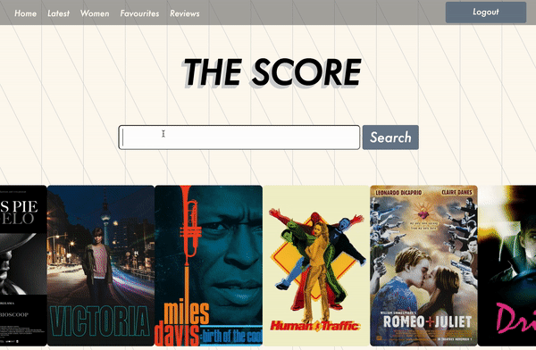
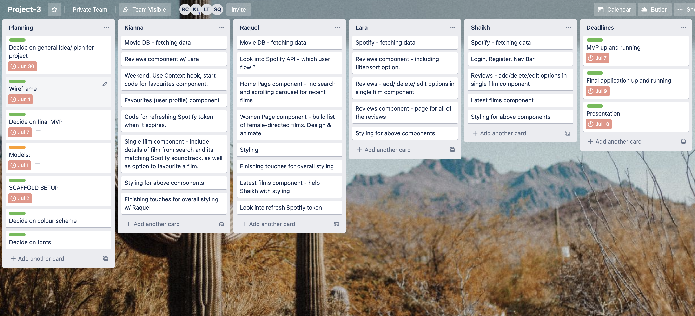
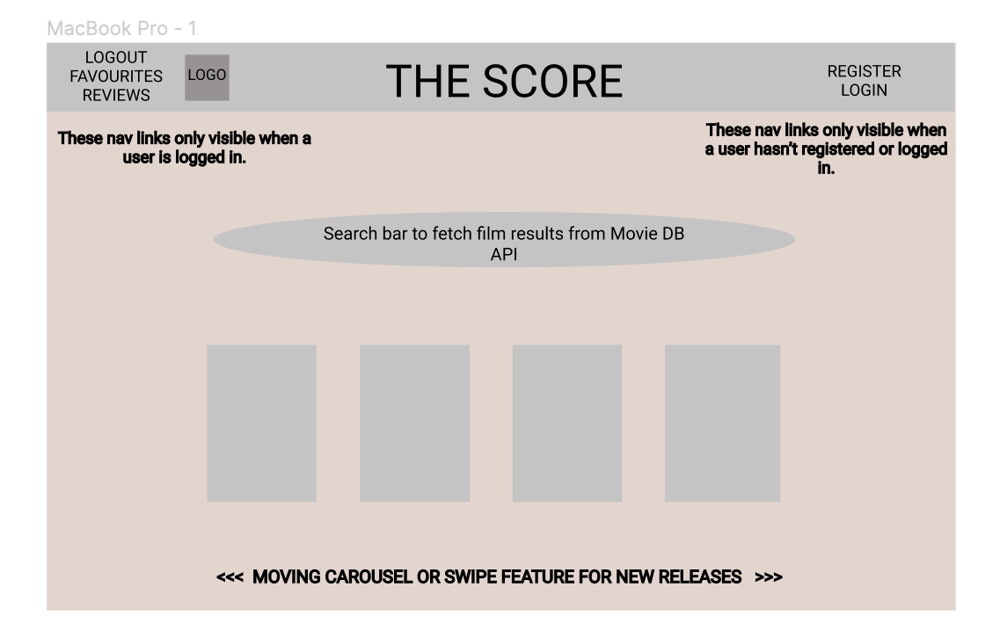
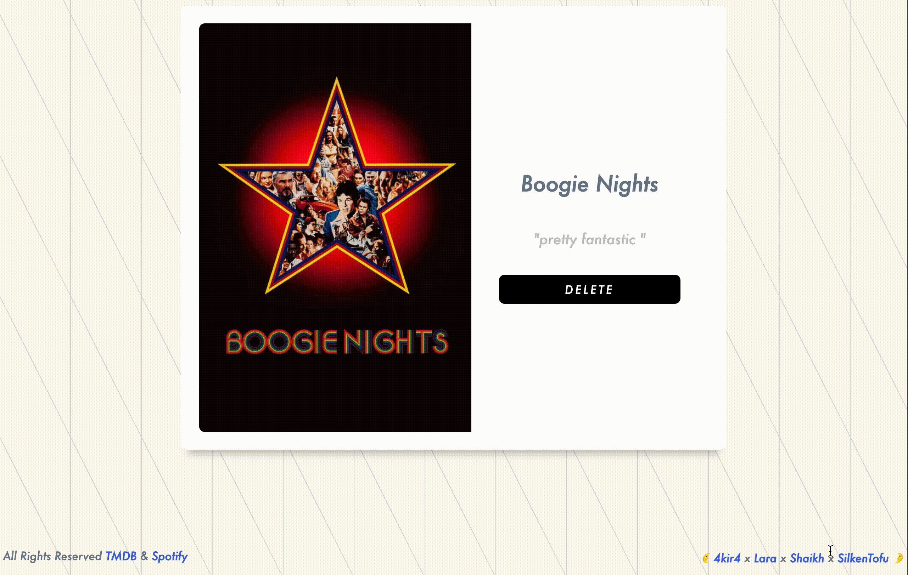

# 
# Project 3 - THE SCORE 

By [Raquel Cruickshank](https://github.com/cruickshankrpc) + [Kianna Love](https://github.com/akirakianna) + [Lara Thompson](https://github.com/larathompson) + [Shaik Qayum](https://github.com/shaikhqayum)

## Overview

My first experience of a group coding project. In spite of our challenges (particularly with **Git**...), it was ultimately a very positive learning experience.\
I was chuffed that my teammates were onboard with the idea I floated of connecting a film database API to a music streaming API to return film soundtracks in this full-stack MERN application.\
Once logged in, users can: 
- Search films and return their soundtracks.
- Favourite films.
- Write/Edit/Delete reviews.
- Browse film lists/reviews/favourites.

Have a browse [here](https://the-final-score.herokuapp.com/).

Register/Login with:\
Email: **tofu@tofu.com**\
Password: **tofu**


<p align=center>

</p>


## Contents
  - [Overview](#overview)
  - [Brief](#brief)
  - [Technologies Used](#technologies-used)
  - [Installation](#installation)
  - [Planning](#planning)
  - [Responsibilities](#responsibilities)
    - [HomePage](#HomePage)
    - [Linking Apis](#linking-apis)
    - [Women](#women)
    - [Flourishes](#flourishes)
  - [Wins & Challenges](#wins-&-challenges)
  - [Bugs](#bugs)
  - [Future Features](#future-features)
  - [Lessons Learned](#lessons-learned)

## Brief
- Work in a team, using git to code collaboratively.
- Build a full-stack application by making your own backend and frontend.
- Use an Express API to serve your data from a Mongo database.
- Consume your API with a frontend built with React.
- Be a complete product which most likely means multiple relationships and **CRUD** (Create, Read, Update & Delete) functionality for at least a couple of models.
- Implement thoughtful user stories/wireframes.
- Have a visually impressive design.
- Be deployed online.

*Timeframe*: **8 days**

## Technologies Used
- HTML5
- SCSS
- React
- JSX
- JavaScript
- Node.js (+ Bcrypt)
- Express
- Webpack
- Spotify API
- MovieDB API
- MongoDB + Mongoose
- Git + Github
- Insomnia 
- JWT
- Axios
- Moment
- AOS (Animate On Scroll)
- Trello
- Figma

## Installation
- Clone/download repo
- In Terminal: 
  - Install dependencies -> <code>npm i</code>
  - Seed -> <code>npm run seed</code>
  - Start the database -> <code>mongod --dbpath ~/data/db</code>
  - Start the frontend -> <code>npm run:front</code>
  - Start the backend -> <code>npm run:back</code>

## Planning

We were careful to delegate tasks and plan our MVP in order to build quickly and get the most functionality possible:



We also used Figma to sketch out our design: 




## Responsibilities 

### HomePage

I wrote the HomePage component as follows using the **React Hooks** **useState** and **useEffect** in order to display data from MovieDB in the carousel. I made a custom list on the website and made an **axios** get request to the list ID endpoint. I also used a .sort() **Array method** to return a shuffled filmed list so that different films are visible every time you visit the page.\

```Javascript
  const [search, setSearch] = useState('')
  const [movieSearchResults, setMovieSearchResults] = useState([])
  const [movieCarousel, setMovieCarousel] = useState([])


  const ourMovieList = (() => {
    axios.get(`https://api.themoviedb.org/3/list/5224231?api_key=${API_KEY}&language=en-US&page=1`)
      .then(movie => {
        setMovieCarousel(movie.data.items)
        return movie.data.items
      })
      .then(movie => {
        const shuffledMovies = movie.sort((a, b) => {
          return 0.5 - Math.random()
        })
        setMovieCarousel([...shuffledMovies])
      })
  })

  useEffect(() => {
    ourMovieList()
  }, [])

```
**Functions** & **event listeners** to return movies from search input:

```Javascript
  const getMovies = (() => {
    axios.get(`https://api.themoviedb.org/3/search/movie?api_key=${API_KEY}&language=en-US&query=${search}&page=1&include_adult=false`)
      .then(movie => {
        setMovieSearchResults(movie.data.results)
      })
  })

  const updateSearch = e => {
    setSearch(e.target.value)
  }

  const getSearch = e => {
    e.preventDefault()
    getMovies()
    setSearch('')
  }
```
### Linking APIs

Inside a **useEffect** in the SingleMovie component, I used a **prop**... 

```Javascript
const movieName = props.match.params.name
```

...to carry over the search input, and used a **template literal** in the Spotify API **axios** request with the addition of 'soundtrack'. I then set setSoundtrackData to return the FIRST result in the array, which is usually the OST/most popular user generated soundtrack. This was a little ~hacky~ and doesn't always display the correct soundtrack/ sometimes films don't return a playlist. However, mostly it works and was a good compromise given time constraints ! 

```Javascript
axios.get(`https://api.spotify.com/v1/search?q=${movieName}soundtrack&type=playlist`,
      {
        headers: { 'Authorization': `Bearer ${spotifyInfo}` }
      })
      .then(axiosResp => {
        setTimeout(() => {
          setSoundtrackData(axiosResp.data.playlists.items[0].id)
          console.log('hello')
        }, 150)
      })
      .catch(err => console.log(err.response))
```
### Women 

<p align=center>

</p>

As with the carousel on HomePage, I built a custom film list and made an axios request to that film list ID.\
I also used AOS (Animate On Scroll) library to add smooth animations to the film cards. 

```Javascript
  useEffect(() => {
    window.addEventListener('scroll', handleScroll)
    return () => window.removeEventListener('scroll', handleScroll)
  }, [])

  function handleScroll(event) {
    // new piece of state to reveal animation, true/false once past certain distance 
    console.log('scrolled!')
  }
```

I used JSX to return elements on the page, and mapped over the retrieved data to display film cards:

```Javascript
  return <>
    <section className="women-section">
      <h1 className="tracking-in-expand">AWARD-WINNING FILMS MADE BY WOMEN</h1>

      <div className="women-movie-container">

        {movies.map((movie, index) => {
          return <>
            <div className="women-poster-container" data-aos="flip-left" aos-duration="600" key={index}>
              <Link to={`/movie/${movie.title}/${movie.id}`}>
                <div>
                  
                </div>
              </Link>
              <div className="bio-container" data-aos="new-animation">
                <p><span>RELEASE DATE:</span><br/>{`${movie.release_date}`}</p>
                <p><span>OVERVIEW:</span> <br/>{`${movie.overview}`}</p>
              </div>
            </div>
          </>
        })}
      </div>
    </section>
  </>
```
I also made this **mobile responsive**:


### Flourishes

Perhaps rather unnecessarily - though I do love the small details - I also added a footer with an animation and links to our GitHub accounts and to the accredited Spotify and MovieDB API websites.



## Wins & Challenges

I enjoyed this project a lot because of the creative freedom we had. Also, it just meant that I got to combine my two loves to build a product I would actually use.\
The Spotify API was very difficult to use, and I spent a lot of time trying to get the auth to work. Then, we realised the token expired every hour and had to write a refresh function.\
Initially, we struggled with Git conflicts, but we quickly learnt to communicate better in order to avoid these. Also, although we tried to make our app mobile responsive, we only did this as an afterthought and didn't dedicate the necessary time/attention to make it look sleek on mobile.

## Bugs
- Films don't always return soundtracks !
- If you try to leave a second review the page breaks.

## Future Features 
- Add 'Queer' film list page.  
- Design feature to allow users to comment on each others' reviews.
- Build and share film lists amongst users. 
- REFACTOR CODE. Our SCSS especially could do with some cleaning up. 

## Lessons Learned
- Use separate SCSS files.
- COMMUNICATION.
- Delegating based on strengths.


